---
## Front matter
title: "Лабораторная работа 1"
subtitle: "Установка ОС Linux"
author: "Елисейкина Надежда Михайловна"

## Generic otions
lang: ru-RU
toc-title: "Содержание"

## Bibliography
bibliography: bib/cite.bib
csl: pandoc/csl/gost-r-7-0-5-2008-numeric.csl

## Pdf output format
toc: true # Table of contents
toc-depth: 2
lof: true # List of figures
lot: true # List of tables
fontsize: 12pt
linestretch: 1.5
papersize: a4
documentclass: scrreprt
## I18n polyglossia
polyglossia-lang:
  name: russian
  options:
	- spelling=modern
	- babelshorthands=true
polyglossia-otherlangs:
  name: english
## I18n babel
babel-lang: russian
babel-otherlangs: english
## Fonts
mainfont: IBM Plex Serif
romanfont: IBM Plex Serif
sansfont: IBM Plex Sans
monofont: IBM Plex Mono
mathfont: STIX Two Math
mainfontoptions: Ligatures=Common,Ligatures=TeX,Scale=0.94
romanfontoptions: Ligatures=Common,Ligatures=TeX,Scale=0.94
sansfontoptions: Ligatures=Common,Ligatures=TeX,Scale=MatchLowercase,Scale=0.94
monofontoptions: Scale=MatchLowercase,Scale=0.94,FakeStretch=0.9
mathfontoptions:
## Biblatex
biblatex: true
biblio-style: "gost-numeric"
biblatexoptions:
  - parentracker=true
  - backend=biber
  - hyperref=auto
  - language=auto
  - autolang=other*
  - citestyle=gost-numeric
## Pandoc-crossref LaTeX customization
figureTitle: "Рис."
tableTitle: "Таблица"
listingTitle: "Листинг"
lofTitle: "Список иллюстраций"
lotTitle: "Список таблиц"
lolTitle: "Листинги"
## Misc options
indent: true
header-includes:
  - \usepackage{indentfirst}
  - \usepackage{float} # keep figures where there are in the text
  - \floatplacement{figure}{H} # keep figures where there are in the text
---

# Цель работы

Приобретение практических навыков установки операционной системы на виртуальную машину, настройки минимально необходимых для дальнейшей работы сервисов.

# Задание

1. Запустить обновление пакетов (т.к. в прошлом семестре мы уже выполняли установку виртуальной машины, поэтому начали выполнение лабораторной работы не с начала).
2. Настроить автоматическое обновление, установить tmux и отключить SELinux.
3. Установить драйвера для вирутальной машины и подключить гостевую ОС.
4. Установить и проверить имя пользователя и название хоста.
5. Проверить наличие pandoc и TexLive (при необходимости установить).
6. Выполнить домашнее задание.
7. Ответить на контрольные вопросы.

# Теоретическое введение

Здесь описываются теоретические аспекты, связанные с выполнением работы.
Например, в табл. 3.1 приведено краткое описание стандартных каталогов Unix.

В табл. [-@tbl:std-dir] приведено краткое описание стандартных каталогов Unix.

: Описание некоторых каталогов файловой системы GNU Linux {#tbl:std-dir}

| Имя каталога | Описание каталога                                                                                                          |
|--------------|----------------------------------------------------------------------------------------------------------------------------|
| `/`          | Корневая директория, содержащая всю файловую                                                                               |
| `bin`        | Основные системные утилиты, необходимые как в однопользовательском режиме, так и при обычной работе всем пользователям     |
| `/etc`       | Общесистемные конфигурационные файлы и файлы конфигурации установленных программ                                           |
| `/ home`     | Содержит домашние директории пользователей, которые, в свою очередь, содержат персональные настройки и данные пользователя |
| `/ root`     | Домашняя директория пользователя root                                                                                      |
|`/tmp`        | временные файлы                                                                                                            |

Более подробно об Unix см. в [1–7].

# Выполнение лабораторной работы

1. В прошлом семестре мы уже выполняли установку виртуальной машины, поэтому начали выполнение лабораторной работы не с начала. (рис. 4.1).

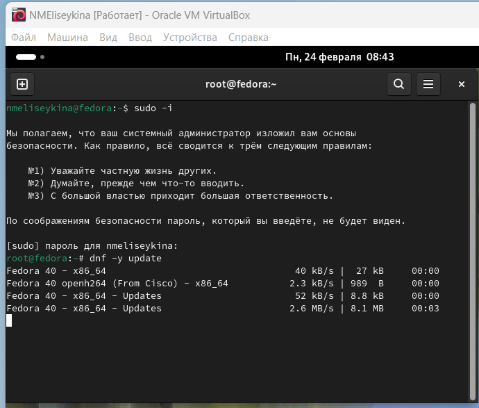{#fig:001 width=70%}

2. Настраиваем автоматическое обновление, устанавливаем tmux и отключаем SELinux (рис. 4.2–4.4). 

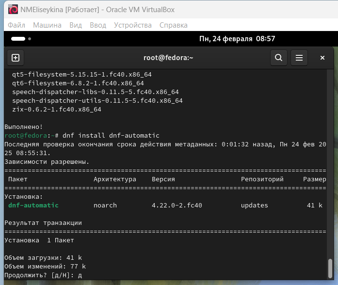{#fig:002 width=70%}

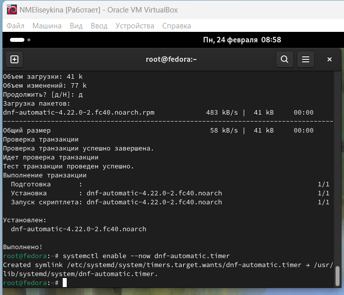{#fig:003 width=70%}

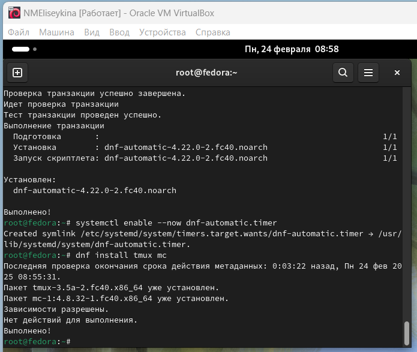{#fig:004 width=70%}

3. Устанавливаем драйвера для виртульной машины и подключаем гостевой ОС (рис. 4.5-4.6). 

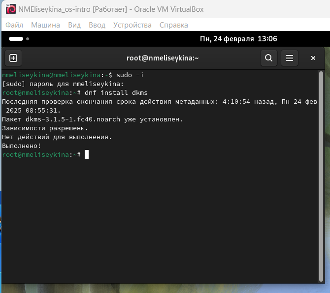{#fig:005 width=70%}

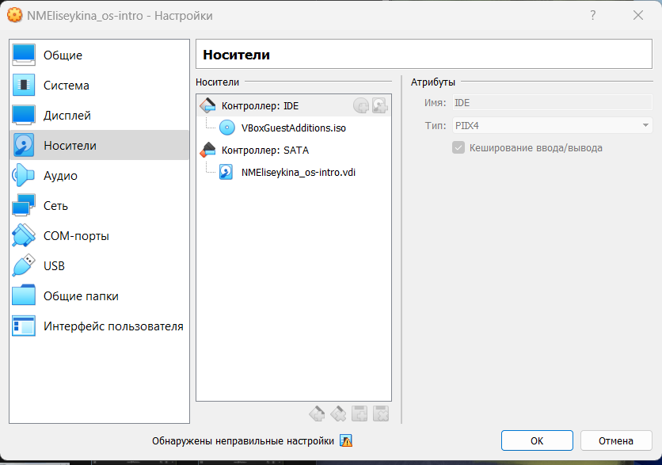{#fig:006 width=70%}

4. Устанавливаем и проверяем имя пользователя и название хоста (рис. 4.7). 

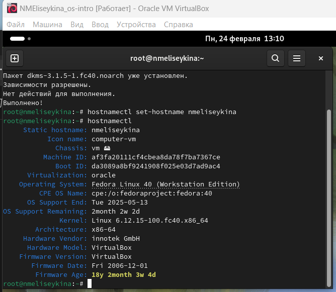{#fig:007 width=70%}

5. Проверяем наличие pandoc (был установлен в прошлых лабораторных работах, проверка наличия) и установка TexLive. (рис. 4.8-4.9)

{#fig:008 width=70%}
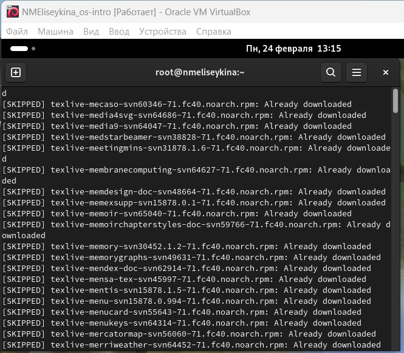{#fig:009 width=70%}

Домашнее задание

С помощью команды dmwsg необходимо получить некоторую информации о компьютере.

1. Версия ядра Linux (рис.4.10).

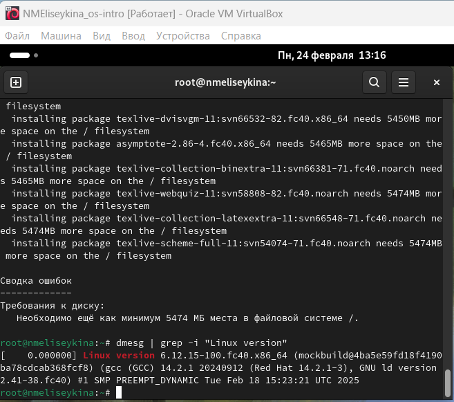{#fig:010 width=70%}

2. Частота процессора (рис. 4.11).

{#fig:011 width=70%}

3. Модель процессора (рис.4.12).

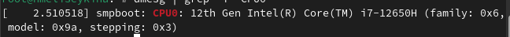{#fig:012 width=70%}

4. Объем оперативной доступной памяти (рис. 4.13).

{#fig:013 width=70%}

5. Тип обнаруживаемого гипервизора (рис.4.14).

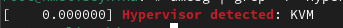{#fig:014 width=70%}

6. Тип файловой системы корневого раздела (рис.4.15).

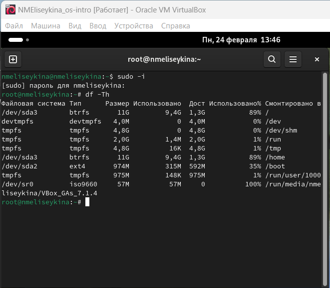{#fig:015 width=70%}

7. Последовательность монтирования файловых систем (рис.4.16).

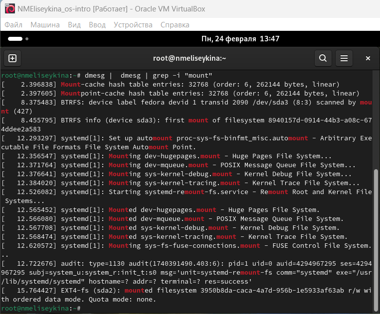{#fig:016 width=70%}

Контрольные вопросы
1. Какую информацию содержит учётная запись пользователя? Имя пользователя (user name)
Индентификационный номер пользвателя (UID)
Индентификационный номер группы (GID)
Пароль (password)
Полное имя (full name)
Домашний каталог (home directory)
Начальную оболочку (login shell)
2. Укажите команды терминала и приведите примеры:
для получения справки по команде –help

для перемещения по файловой системе -cd

для просмотра содержимого каталога -ls

для определения объёма каталога du

для создания / удаления каталогов / файлов - mkdir -создание, rm -r - удаление

для задания определённых прав на файл / каталог- touch/rm

для просмотра истории команд –history

3. Что такое файловая система? Приведите примеры с краткой характеристикой.

Файловая система - порядок, определяющий способ организации, хранения и
наименования данных на носителях информации в пк, а также в другом электронном оборудовании: цифровых фотоаппаратах, мобильных телефона и тд. Файловая система определяет формат содержимого и способ физического хранения информации, которую принято группировать в виде файлов. Конкретная файловая система и раздел, набор атрибутов файла. Некоторые файловые системы представляют сервисные возможности, например, разграничение доступа или шифрование файлов.
4. Как посмотреть, какие файловые системы подмонтированы в ОС?
Df-утилита, показывающая список всех файловых систем по имени устройства, сообщает их размер, занятое и свободное пространство и точки монтирования.
При выполнении бещ аргумента, команда mount выведет все подключенные
данные.
5. Как удалить зависший процесс?
С помощью команды killall-killall ().

# Выводы

Приобрели практические навыки установки операционной системы на виртуальную машину, настройки минимально необходимых для дальнейшей работы сервисов.

# Список литературы{.unnumbered}

1. Dash, P. Getting Started with Oracle VM VirtualBox / P. Dash. – Packt Publishing Ltd, 2013. – 86 сс.
2. Colvin, H. VirtualBox: An Ultimate Guide Book on Virtualization with VirtualBox. VirtualBox / H. Colvin. – CreateSpace Independent Publishing Platform, 2015. – 70 сс.
3.  Vugt, S. van. Red Hat RHCSA/RHCE 7 cert guide : Red Hat Enterprise Linux 7 (EX200 and EX300) : Certification Guide. Red Hat RHCSA/RHCE 7 cert guide / S. van Vugt. – Pearson IT Certification, 2016. – 1008 сс.
4. Робачевский, А. Операционная система UNIX / А. Робачевский, С. Немнюгин, О. Стесик. – 2-е изд. – Санкт-Петербург : БХВ-Петербург, 2010. – 656 сс.
5. Немет, Э. Unix и Linux: руководство системного администратора. Unix и Linux / Э. Немет, Г. Снайдер, Т.Р. Хейн, Б. Уэйли. – 4-е изд. – Вильямс, 2014. – 1312 сс.
6. Колисниченко, Д.Н. Самоучитель системного администратора Linux : Системный администратор / Д.Н. Колисниченко. – Санкт-Петербург : БХВ-Петербург, 2011. – 544 сс.
7. Robbins, A. Bash Pocket Reference / A. Robbins. – O’Reilly Media, 2016. – 156 сс.

::: {#refs}
:::
