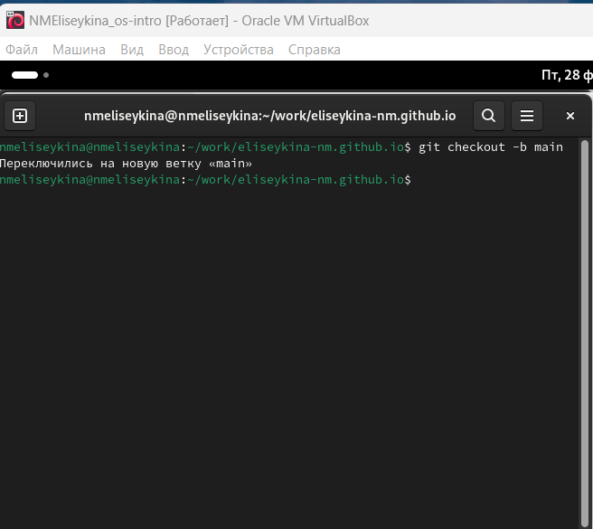
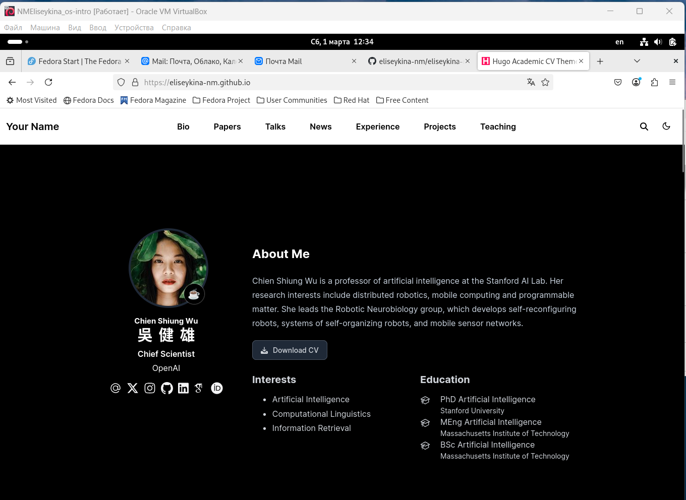

---
## Front matter
lang: ru-RU
title: Индивидуальный проект. Этап 1.
subtitle: Создание своего сайта по шаблону.
author:
  - Елисейкина Н.М.
institute:
  - Российский университет дружбы народов, Москва, Россия
date: 8 марта 2025

## i18n babel
babel-lang: russian
babel-otherlangs: english

## Formatting pdf
toc: false
toc-title: Содержание
slide_level: 2
aspectratio: 169
section-titles: true
theme: metropolis
header-includes:
 - \metroset{progressbar=frametitle,sectionpage=progressbar,numbering=fraction}
 - '\makeatletter'
 - '\beamer@ignorenonframefalse'
 - '\makeatother'
---

# Информация

## Докладчик

:::::::::::::: {.columns align=center}
::: {.column width="70%"}

  * Елисейкина Надежда Михайловна
  * Студентка 1го курса, НММбд-02-24
  * Математика и механика
  * Российский университет дружбы народов
  * [Github](https://github.com/eliseykina-nm/study_2024-2025_os-intro)

:::
::: {.column width="30%"}

:::
::::::::::::::

# Вводная часть

## Актуальность

- Наличие своего сайта способствует более легкому, простому и современному представлению себя в обществе.

- Также, оно облегчает жизнь и для работника, и для работодателя, позволяя указать всю нужную информацию, аналогично и в научных кругах.

## Объект и предмет исследования

- Персональный сайт научного работника

## Цели и задачи

Первым этапом является размещение на Github pages заготовки для персонального сайта. Для этого необходимо:

- Установить необходимое программное обеспечение.

- Скачать шаблон темы сайта.

- Разместить его на хостинге git.

- Установить параметр для URLs сайта.

- Разместить заготовку сайта на Github pages.

# Создание заготовки для персонального сайта

## Загрузка HUGO

Загружаем последнюю версию hugo и извлекаем в папку */usr/local/bin*:

{#fig:001 width=70%}

{#fig:002 width=70%}

## Cоздание и клонирование нового репозитория

{#fig:003 width=70%}

## Cоздание и клонирование нового репозитория

{#fig:004 width=70%}

## Запуск HUGO

{#fig:005 width=70%}

## Cоздание нового репозитория

Название репозитория должно полностью совпадать с именем владельца + github.io:

{#fig:006 width=70%}

## Kzлонирование нового репозитория

{#fig:007 width=70%}

## Создание пустого файла и отправка изменений

{#fig:008 width=70%}

{#fig:009 width=70%}

## Выполнение команды hugo

Создаем ветку подмодуля, клонируя репозиторий с нашего Github:

{#fig:011 width=70%}

## Подгрузка изменений на  Github

{#fig:012 width=70%}

{#fig:013 width=70%}

## Открываем наш сайт

{#fig:014 width=70%}

# Результаты

В ходе данной работы я создала шаблон своего сайта, который в будущем буду дорабатывать, а также запрепила навыки работы с системой контроля версий *Git*.

# Список литературы{.unnumbered}

1. [Этапы реализации проекта](https://esystem.rudn.ru/mod/page/view.php?id=970806&forceview=1)

2. [Техническая реализация проекта](https://esystem.rudn.ru/mod/page/view.php?id=970807&forceview=1)

3. [Руководство по выполнению первого этапа индивидуального проекта](https://esystem.rudn.ru/mod/url/view.php?id=980904&forceview=1)

4. [Инструменты Git - Подмодули](https://git-scm.com/book/ru/v2/%D0%98%D0%BD%D1%81%D1%82%D1%80%D1%83%D0%BC%D0%B5%D0%BD%D1%82%D1%8B-Git-%D0%9F%D0%BE%D0%B4%D0%BC%D0%BE%D0%B4%D1%83%D0%BB%D0%B8)
